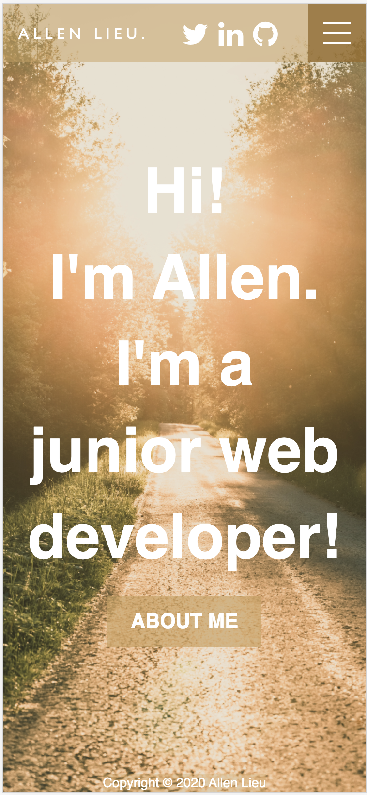

# URL Links

**Portfolio website:** https://allen-portfolio-t1a3.netlify.app/index.html

**GitHub Repository:** https://github.com/CodingFantaC/AllenLieu_T1A3

# Purpose/Target Audience

This portfolio is to showcase my HTML/CSS skills (after 2 weeks) and to display to potential future employers. This portfolio conveys my design skills, information about me, contact information, other projects and blog posts.

# Tech Stack

- HTML
- CSS
- SRI (Subresource Integrity )
- Netlify (deployment platform)

# Sitemap

# Functionality/Features

Responsive design for desktop, tablet and mobile. Includes icons for social links and programming languages, nav bar with hamburger menu and social links, contact form with resume included on page, projects and blog pages, and about me page.

##### Home page (desktop view)

##### Home page (tablet view)

##### Home page (mobile view)

##### Nav bar on top that includes hamburger menu, social links, and name that links to home page

##### Hamburger menu screen overlay and projects page (mobile view)

##### Button link (desktop view)

##### Button link on hover (desktop view)

##### Contact form and resume (mobile view)

##### Blog page with images, title, post date and author (mobile view)

##### About page with image and language icons (tablet view)

